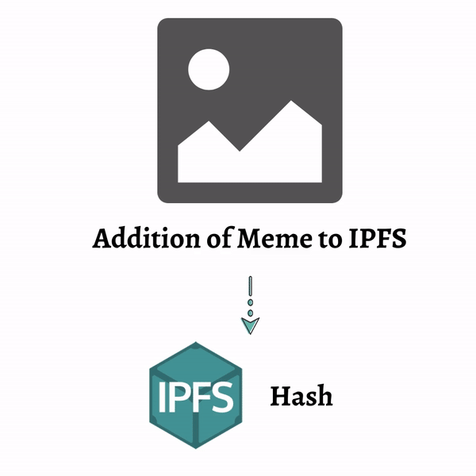

## 😎🤩MemePedia😋😎
### 🚀Unprejudiced, Vigilant, Virtual Meme Sharing Decentralized NFT Platform using IPFS, FileCoin, Polygon and Celo.🚀

## Problem Statement
‘Meme Sharing’ on social media platforms forms a large part of the entertainment industry. Huge shares of this content often deprives the owner of the recognition for the content. 

To address this issue, we have implemented a decentralized platform for users to share memes. The main aim here is to facilitate maximum shares while also maintaining the owner at forefront.  

Herein, The memes uploaded by the user are hashed and are verified for the originality in content, their appropriateness. 
To accomplish this, three layers of checks are incorporated. 

First layer compares the hash of the image with existing hash available in IPFS metadata. If an exact match is found, the meme is discarded. 

In the second layer , the meme is checked for its appropriateness using SafeSearch provided by the Google Cloud Vision API, which checks for racially offensive, adult and violent content. The result gives a degree of offense ranging from very unlikely to very likely. Any meme, with a degree ‘very likely’ is discarded. 

In the third layer, based on the image and content of the image, similar memes from the IPFS are shown to the user. For this, we extracted image embeddings from the memes by passing them through the VGG19 model. These embeddings are then compared with existing embeddings using cosine similarity. Memes having 90% similarity are discarded. Images having greater than 50% resemblance are clustered and displayed to the user. 

Once the meme passes through all 3 layers, it is uploaded to IPFS and an NFT is minted for the meme. This NFT can be later used as a token for purchase, promotion of brands etc.

## Concept Diagram

